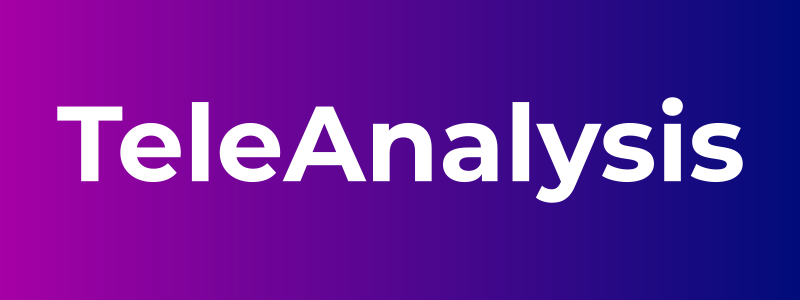
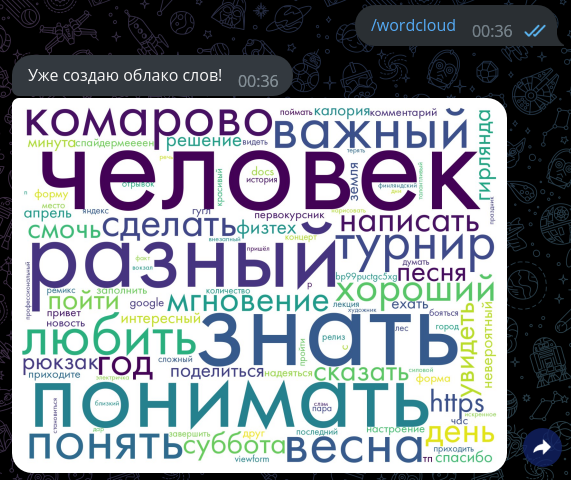
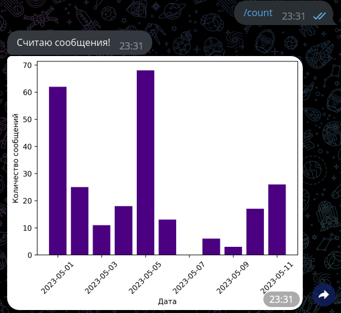

# TeleAnalysis bot

## Возможности:

1. Облако слов из сообщений в чате
2. Выжимка из переписки (на аудиосообщениях не работает)
3. Статистика по частям речи, используемым в переписке
4. Статистика по количеству сообщений во времени
5. Шифрование и дешифрование сообщений и сохранение в базу данных

## Стек технологий:

1. Python
2. Aiogram - бот
3. Telethon - парсинг
4. Pandas - хранение и обработка сообщений
5. Spacy - nlp, анализ текста (работает локально)
6. Matplotlib - графики, облако слов
7. Vosk - распознавание аудиосообщений (работает локально)
8. SQLAlchemy
9. PostgreSQL

## Запуск:

1. Из директории проекта запустите `pip3 install -r requirements.txt`
2. Создайте приложение на [сайте Telegram](https://my.telegram.org/auth?to=apps), вставьте `api_id` и `api_hash` в файл `config.ini`.
3. Создайте бота в [BotFather](https://t.me/BotFather), вставьте `HTTP API` в файл `config.ini`.
4. Скачайте последнюю модель для русского языка [Vosk](https://alphacephei.com/vosk/models)
    * Создайте папку `model` в папке проекта
    * Распакуйте архив с моделью в эту папку
5. Запустите контейнер с базой данных командой `sudo docker-compose up -d`
6. Запустите проект из его директории командой `python3 main.py`
    * Если проект попросит войти в свой аккаунт Telegram, сделайте это

## Примеры работы:

